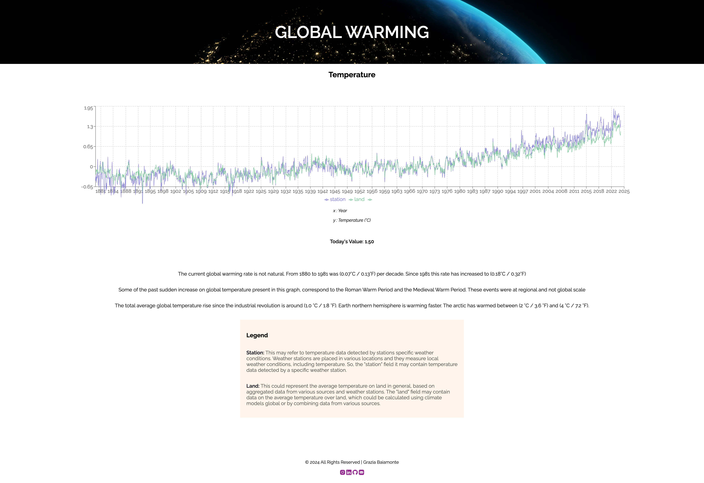

# Wordpress Custom Theme

A custom WordPress theme developed for a client selling coffee and alcohol online. The theme is designed for a sleek, lightweight, and easy-to-manage e-commerce experience, with a strong focus on user experience, WooCommerce integration, and customization.

## ⚙️ Tech Stack

- Html
- Css
- JS
- Php
- Three.js
- Gsap
- Lenis

## ✨ Features

- **Responsive Design**

- **Animations with GSAP**: transitions and micro-animations that enhance the user experience without compromising performance.

- **Three.js integration**: support for 3D objects and animations to create interactive and dynamic site elements.

- **Smooth scrolling with Lenis**: seamless scrolling effect for a more natural and immersive navigation.

- **WooCommerce Ready**: full compatibility with WooCommerce for catalog, cart, and checkout management.

- **Custom templates**: dedicated layouts for shop, categories, product pages, and informational sections.

- **Optimized performance**: asynchronous script loading, optimized images, and minimized JS/CSS bundles.

